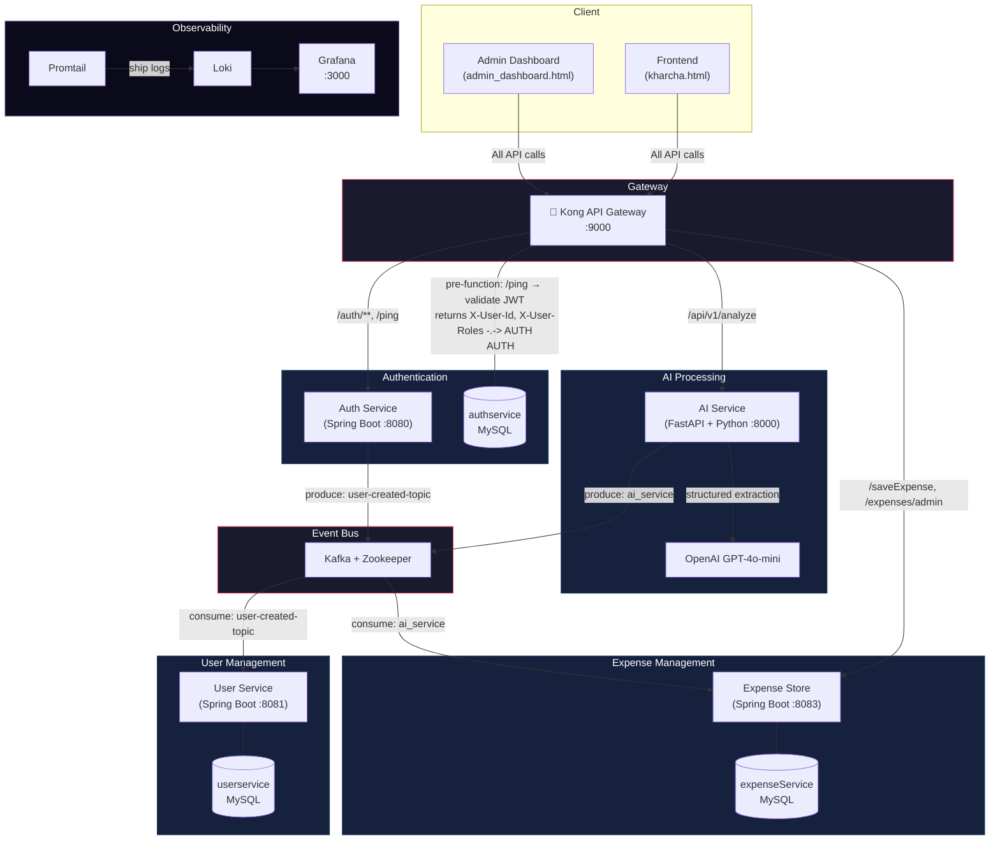
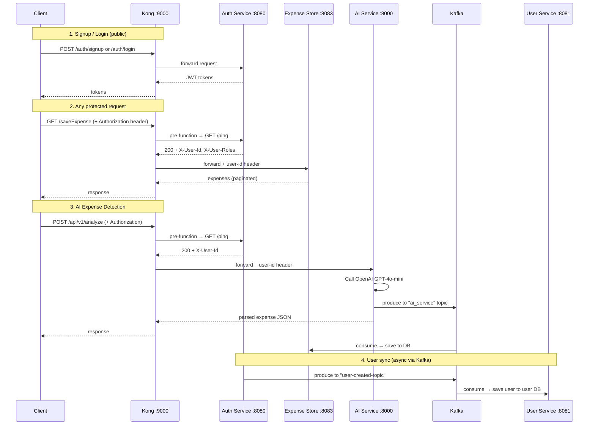

# Kharcha — AI-Powered Expense Tracker

A microservices-based expense tracking application with AI-powered expense detection, admin dashboard, and centralized logging — all behind a Kong API Gateway.

---

## Architecture



---

## Request Flow



---

## Services & Ports

| Service | Tech Stack | Internal Port | External Port | Description |
|---------|-----------|---------------|---------------|-------------|
| **Kong Gateway** | Kong 3.9 OSS (DB-less) | 8000 | **9000** | API gateway — single entry point for all client traffic. Pre-function Lua plugins validate JWT via `/ping`, inject `user-id` header, enforce admin role. |
| **Auth Service** | Spring Boot 3.4.3, Java 21 | 8080 | 8080 | Signup, login, JWT generation/validation, refresh tokens, admin user management. Seeds default `ROLE_USER` + `ROLE_ADMIN` roles. |
| **User Service** | Spring Boot 3.4.3, Java 21 | 8081 | 8081 | Stores user profile data. Consumes `user-created-topic` from Kafka to sync users created in Auth Service. |
| **Expense Store** | Spring Boot 3.4.3, Java 21 | 8083 | 8083 | CRUD for expenses. Consumes `ai_service` Kafka topic for AI-detected expenses. Admin endpoint for viewing any user's expenses. |
| **AI Service** | FastAPI, Python 3.11, OpenAI | 8000 | 8000 | Accepts natural language text, calls GPT-4o-mini with structured output to extract expense data (amount, merchant, currency, description, date). Produces to Kafka. |
| **MySQL** | MySQL 8.0 | 3306 | 3306 | Shared database for all Java services (single instance, separate tables). |
| **Kafka** | Confluent 7.6.0 | 9092 | 9092 | Event bus. Topics: `user-created-topic`, `ai_service`. |
| **Zookeeper** | Confluent 7.6.0 | 2181 | — | Kafka coordination. |
| **Loki** | Grafana Loki 3.4.2 | 3100 | 3100 | Log aggregation backend (TSDB storage, 7-day retention). |
| **Promtail** | Grafana Promtail 3.4.2 | — | — | Collects Docker container logs via socket and ships to Loki. |
| **Grafana** | Grafana 11.5.2 | 3000 | **3000** | Dashboards & log exploration. Pre-provisioned Kharcha Logs dashboard. |

---

## Kafka Topics

| Topic | Producer | Consumer | Payload |
|-------|----------|----------|---------|
| `user-created-topic` | Auth Service | User Service | `{ email, name, userName, userId }` |
| `ai_service` | AI Service | Expense Store | `{ amount, merchant, currency, description, created_at, user_id }` |

---

## Quick Start

```bash
# 1. Set your OpenAI API key
export OPENAI_API_KEY=sk-...

# 2. Build and start everything
docker compose up --build -d

# 3. Wait for Java services to boot, then open:
#    App:       http://localhost:9000  (via kharcha.html)
#    Admin:     http://localhost:9000  (via admin_dashboard.html)
#    Grafana:   http://localhost:3000  (admin / kharcha)
```

### Default Admin Credentials
| Field | Value |
|-------|-------|
| Username | `admin` |
| Password | `admin` |

The admin user is seeded automatically on first boot by `DataSeeder.java`.

---

## Project Structure

```
Kharcha/
├── AuthService/          # JWT auth, user registration, admin endpoints
├── UserService/          # User profile storage (Kafka consumer)
├── ExpenseStore/         # Expense CRUD + AI expense consumer
├── ai-service/           # FastAPI + OpenAI LLM integration
├── kong-gateway/         # Kong declarative config (kong.yml)
├── monitoring/
│   ├── loki/             # Loki log aggregation config
│   ├── promtail/         # Promtail log collector config
│   └── grafana/          # Grafana provisioning (datasource + dashboard)
├── kharcha.html          # Main expense tracker frontend
├── admin_dashboard.html  # Admin panel frontend
├── docker-compose.yml    # Full stack orchestration
└── README.md
```
